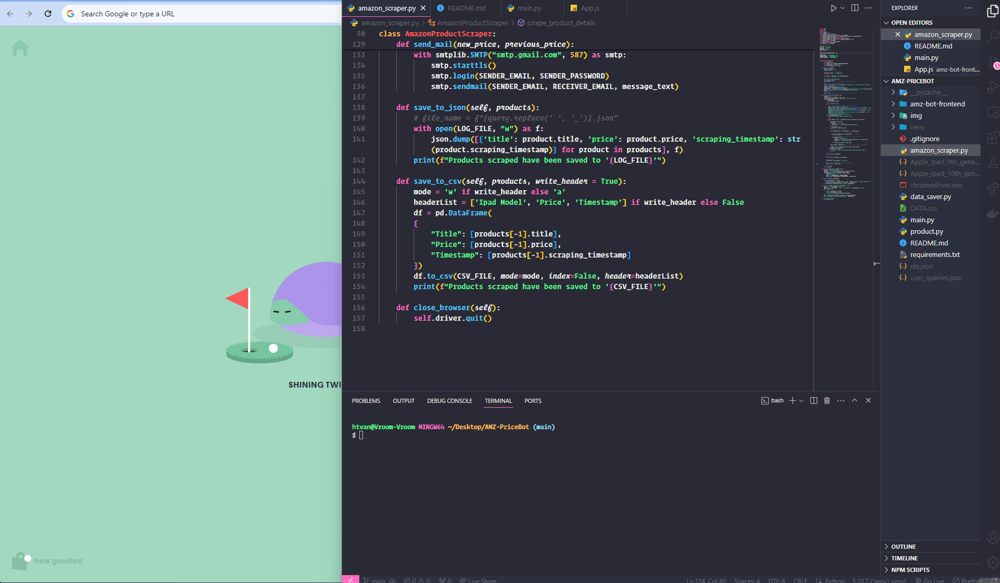

# Project Brief: Automated Price Drop Notification for iPad on Amazon.com



## Objective:
An application that monitors the price of the iPad on Amazon.com and sends an automated notification whenever there's a price drop

## Available Features:

## Project Scopes:

- [X] Handling changes in the webpage structure
- [X] Scripts run at reasonable interval to effectively monitor price changes
- [X] Data Processing:  Implement logic to compare the current price against the previously recorded price to detect a price drop.
- [X] Notification: Upon detecting a price drop, trigger an automated notification
- [X] Logging: Maintain a log of price changes and notification events

### Intuition
- Initially I wanted to develop an program with minimal installation and configurations; After taking quite a long time, I realized Amazon has quite a lot of security measure to prevent people from scraping their data or potentially any malicious cybersecurity risks.

## Installations Required
- Install Chromedriver: [click here](https://googlechromelabs.github.io/chrome-for-testing/#stable)

- VPN Software

## How To Run Application
1. Install `virtualenv`:
```
$ pip install virtualenv
```

2. Open a terminal in the project root directory and run:
```
$ python -m venv venv
```

3. Then run the command:
```
$ .\venv\Scripts\activate (for Powershell/CMD)
or
$ source venv/Scripts/activate (for GitBash)
```

4. Then install the dependencies:
```
$ (env) pip install -r requirements.txt
```

5. Make change to the `headers` variable by replacing value of `User-Agent` :

```
visit [WhatIsMyBrowser.com](https://www.whatismybrowser.com/detect/what-is-my-user-agent/) then copy & paste the User-Agent header
```

6.1 Configure `DEFAULT_TIME_FOR_REPETITION` variable with desired time in `amazon_scraper.py`
```
Example: DEFAULT_TIME_FOR_REPETITION = 300
```

6.2 (Optional) Replace `product_url` variable with desired product URL link in `main.py`
```
URL must should follow this pattern: "https://www.amazon.com/dp/<ASIN_NUMBER>"
```

6.3 Place Chromewebdriver into current working folder or replace `chromedriver_path` with prefered chromedriver.exe downloaded location
```
Example: chromedriver_path = 'C:/User/<name>/Desktop/chromedriver.exe'
```

7.1 Requirements for running data-visualization
```
check for existing Node version: $node --version

check for existing NPM version: $npm --version
```

7.2 Open different terminal and cd into `amz-bot-frontend` folder
```
$ npm install
then
$ npm run
```

8. Finally start the crawler server:
```
$ (env) python main.py
```

---

### How the application works
- Web Crawler: Selenium to mimic real user action, BeautifulSoup4 library helps parse HTML response
- Frontend: React.js and recharts/Chart.js
- Backend: Possible frameworks for future development with server and APIs is Flask (Python)
- Database: currently CSV file (possible for future development MongoDB | PostgreSQL | MySQL)


### Overcome Challenges
- Couldn't establish connection with amazon page --> fixed by adding User-agent, accept, accept-language, accept-encoding in request's header
- Amazon responded only the first time, high chance my IP address was blocked --> attemped using VPN to mask IP address
- When using "requests" or HTML-session, Amazon return 503 ERROR or not enough response's data due to dynamic content loading --> final decision to use Selenium and Chrome Webdriver
- Using generic/hard-coded User-agent for headers doesn't work as well as environ.get()
- Naive price processing eventually encounter difference in posted prices ($1,199 vs $459)

### Reference


